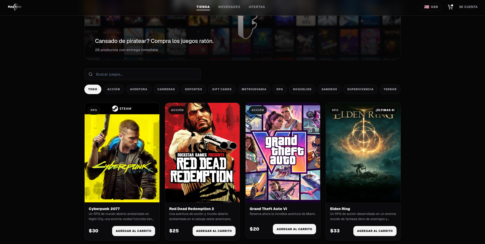

# KeySpot 🎮

E-commerce de videojuegos (tienda de keys) desarrollado como proyecto educativo con **React 19 + TypeScript + Vite + Tailwind CSS 4**. Es una SPA con ruteo client-side, contexto de autenticación y manejo de estado global con Context API.

🔗 Demo en vivo: [key-spot.vercel.app](https://key-spot.vercel.app)



## Stack

| Tecnología            | Uso                                  |
| --------------------- | ------------------------------------ |
| React 19 + TypeScript | UI y tipado                          |
| Vite                  | Build y dev server                   |
| Tailwind CSS 4        | Estilos (tema oscuro monocromo)      |
| React Router 7        | Ruteo SPA + rutas protegidas         |
| canvas-confetti       | Animación de recompensa en Novedades |

## Cómo usarlo

```bash
pnpm install
pnpm dev      # entorno de desarrollo
pnpm build    # typecheck + build de producción
pnpm lint     # eslint
```

No necesita backend por ahora: los productos cargan desde un seed local (`src/data/productos-seed.json`) y la sesión se simula con `AuthProvider`.

## Lo que está hecho

- **Catálogo** con buscador en vivo, filtros por categoría y tarjetas con estado de stock (agotado / últimas unidades).
- **Ruteo SPA**: tienda, novedades, ofertas, login, admin y página 404 propia (también para rutas inexistentes).
- **Panel de admin** protegido con `ProtectedRoute`: si escribís `/admin` en la URL sin sesión de administrador, te expulsa a `/login` (el login simulado solo otorga rol admin a un correo que empiece con `admin`).
- **Novedades**: ruleta con video que aparece una sola vez por usuario (persistido en localStorage) y gift card con confetti al finalizar.
- **Selector de moneda** 🇦🇷|🇺🇸 en el navbar (solo en el home) que convierte todos los precios con `Intl.NumberFormat`.
- **Hook propio** `useLocalStorage<T>` reutilizado para preferencias y flags.

## Lo que falta

- [ ] Página de detalle de producto (`/product/:id` está ruteada pero sin implementar).
- [ ] Carrito real: el botón "Agregar al carrito" hoy solo da feedback visual, falta el estado/contexto y la página `/cart`.
- [ ] Funcionalidad del admin: por ahora muestra la bienvenida, falta listar/editar/eliminar productos (las funciones del `ProductContext` ya están).
- [ ] Autenticación real (hoy es simulada con datos locales, sin backend ni tokens).
- [ ] Página de Ofertas con contenido propio.
- [ ] Pagos (por ahora la gift card solo redirige a login).
- [ ] Persistencia de productos fuera del estado en memoria.

## Estructura

```
src/
├── components/   Navbar, ProductCard, SearchBar, ProtectedRoute
├── context/      Auth, Product y Currency (provider + contexto)
├── hooks/        useLocalStorage, useProduct
├── interfaces/   Product, User
└── pages/        Home, Novedades, Login, AdminPanel, 404error, ProductDetail
```
